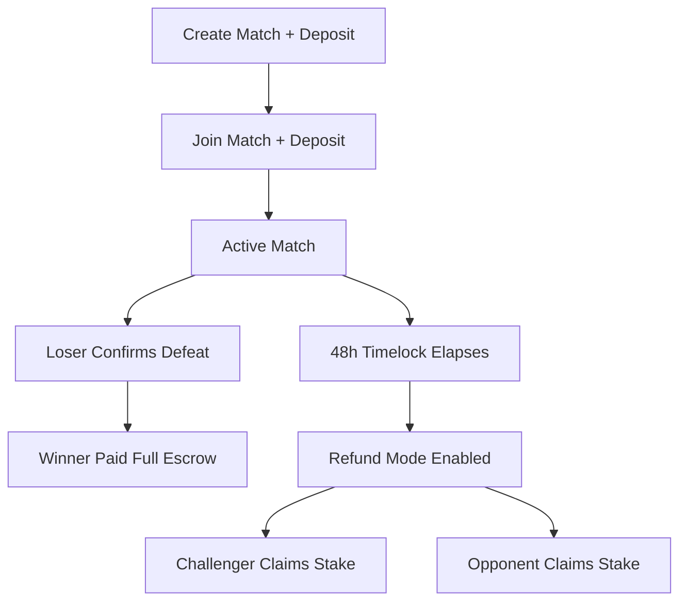

# MoneyMatch Escrow

A Web3 MVP for trust-minimized gaming wagers on Ethereum.

## Normal workflow

1. Challenger creates a match with stake, depositing ETH.
2. Opponent joins with the same stake.
3. Match becomes active.
4. Loser confirms defeat and names the winner.
5. Winner receives the full escrow amount.
6. Replay URL is emitted as an event (not stored in state).
7. If no confirmation occurs after 48 hours from activation, refund mode can be enabled and each player withdraws only their original stake.



## Technology Stack

- Solidity
- Ethereum
- OpenZeppelin
- Hardhat
- React
- TypeScript
- Vite
- Ethers.js v6
- pnpm

## Security Analysis

- **Refusal-to-confirm risk:** mitigated by 48-hour timelock refunds.
- **Economic deadlock risk:** either participant can enable refunds after timeout.
- **Reentrancy:** protected with `ReentrancyGuard` and CEI ordering.
- **Access control:** participant-only actions enforced by strict checks.
- **State safety:** explicit state machine prevents duplicate resolution and double withdrawals.

## Future Improvements

- Arbitrator layer
- NFT match records
- Multi-token support
- Tournament support
- Reputation system

## Repository Layout

```text
/
├── contracts/
│   ├── src/
│   │   ├── MoneyMatchEscrow.sol
│   │   └── RefundReentrancyAttacker.sol
│   ├── test/
│   │   └── MoneyMatchEscrow.ts
│   ├── scripts/
│   │   └── deploy.ts
│   ├── hardhat.config.ts
│   └── package.json
├── frontend/
│   ├── src/
│   ├── public/
│   ├── package.json
│   ├── tsconfig.json
│   └── vite.config.ts
├── README.md
├── LICENSE
└── .gitignore
```

## Local Development Setup

### Prerequisites

- Node.js 20+
- pnpm 9+

### Contracts

```bash
cd contracts
pnpm install
pnpm build
pnpm test
```

Deploy locally:

```bash
cd contracts
pnpm hardhat node
# in another shell
pnpm hardhat run scripts/deploy.ts --network localhost
```

### Frontend

```bash
cd frontend
pnpm install
pnpm dev
```

Set the deployed contract address before running UI:

```bash
echo 'VITE_ESCROW_ADDRESS=0xYourDeployedAddress' > frontend/.env.local
```

## Smart Contract Behavior Summary

- `createMatch(stake)` with exact `msg.value == stake`
- `joinMatch(matchId)` with exact same stake
- `confirmDefeat(matchId, winner, replayUrl)` callable only by loser participant
- `enableRefund(matchId)` after 48h from activation
- `claimRefund(matchId)` lets each participant recover only own original deposit

## Test Coverage Focus

Hardhat tests cover:

- happy path payout,
- timelock refund flow,
- unauthorized access,
- invalid winner declaration,
- double refund prevention,
- duplicate resolution prevention,
- refund reentrancy attempt.

## License

MIT
